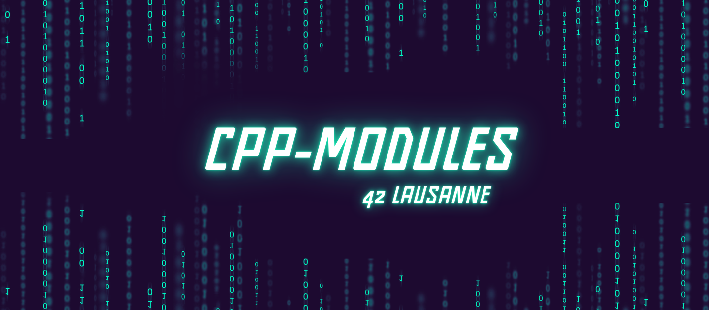

# CPP-Module-ALL
Here I am at a key stage of course **42**: the very first language change, with the transition to C++. This module marks the beginning of a learning process focused on the fundamental concepts of **C++** in its **C++98** standard: *classes, inheritance, polymorphism, STL containers, and many other concepts specific to object-oriented programming.*

[![Contributors][contributors-shield]][contributors-url]
[![Forks][forks-shield]][forks-url]
[![Stargazers][stars-shield]][stars-url]
[![Issues][issues-shield]][issues-url]
[![LinkedIn][linkedin-shield]][linkedin-url]

## 📒 Index

- [About](#about)
- [Installation](#installation)
- [Development](#development)
  - [File Structure](#file-structure)
 <!-- - [Diagram Architecture](#diagram-architecture)  -->
- [Notes](#notes)
- [Credits](#credits)

## About

The **C++ Modules project (CPP00 to CPP09)** aims to familiarize you with the fundamental concepts of the _**C++ language**_, following the **_C++98_** standard. It's a real challenge, especially for those new to **object-oriented programming (OOP)**. Each module addresses a specific concept and gradually increases the difficulty through short, _targeted exercises designed_ to strengthen your understanding and application of key C++ concepts.

*Here's a summary of what each module offers:*<br>

🔹 **CPP Module 00:**<br>
* Introduction to _**namespaces, classes, and member functions**_<br>

* Using **stdio streams** (_*cout*_, _*cin*_)<br>

* Concepts of **constructors**, **initializer lists**, and `static` and `const keywords`<br>

🔹 **CPP Module 01:**
* Dynamic **memory management**

* Using **references** and **pointers to members**

* Control structures like _*switches*_

🔹 **CPP Module 02:**
* **Ad-hoc polymorphism** through **operator overloading**

* Implementing the **canonical form** of a class (_*copy*_, _*assignment*_, _*destructor*_)

🔹 **CPP Module 03:**
* Introduction to inheritance

* Hierarchical class structuring and parent-child relationships

🔹 **CPP Module 04:**
* Runtime **polymorphism**

* Creating _*Abstract classes*_, _*virtual functions*_, and _*interfaces*_

🔹 **CPP Module 5:**
* Review of previous concepts

* Introduction to **exceptions** (`try`, `catch`, `throw`)

🔹 **CPP Module 6:**
* Exploration of different **C++ casts**: `static_cast`, `dynamic_cast`, `const_cast`, `reinterpret_cast`

🔹 **CPP Module 7:**
* Introduction to **templates**

* Creating generic and _*parameterized functions*_ and _*classes*_

🔹 **CPP Module 8:**
* Using **container templates**

* Discovering **iterators** and **STL algorithms**

🔹 **CPP Module 9:**
* Advanced understanding of the **STL** (Standard Template Library)

* Advanced manipulation of `vector`, `list`, `map`, `stack`, `queue`, and associated algorithms

## Installation
```bash
# Clone this repository
$ git clone https://github.com/HaruSnak/CPP-Module-ALL.git

# Go into the repository
$ cd CPP-Module-ALL

# To compile the program
$ make

# Removes all generated files and the executable for a thorough cleanup.
$ make fclean

# Removes generated object files and the executable.
$ make clean
```

## Development
### File Structure

```
.
└── 📁CPP-Module-ALL
    └── 📁Module00
        └── 📁ex00
            └── Makefile
            └── 📁srcs
                └── megaphone.cpp
        └── 📁ex01
            └── 📁includes
                └── awphonebook.hpp
                └── Contact.hpp
                └── PhoneBook.hpp
            └── Makefile
            └── 📁srcs
                └── Contact.cpp
                └── 📁errors
                    └── errors.cpp
                └── main.cpp
                └── PhoneBook.cpp
    └── 📁Module01
        └── 📁ex00
            └── 📁includes
                └── brain.hpp
                └── Zombie.hpp
            └── Makefile
            └── 📁srcs
                └── main.cpp
                └── newZombie.cpp
                └── randomChump.cpp
                └── Zombie.cpp
        └── 📁ex01
            └── 📁includes
                └── moar_brainz.hpp
                └── Zombie.hpp
            └── Makefile
            └── 📁srcs
                └── main.cpp
                └── Zombie.cpp
                └── zombieHorde.cpp
        └── 📁ex02
            └── 📁includes
                └── brain_shout.hpp
            └── Makefile
            └── 📁srcs
                └── main.cpp
        └── 📁ex03
            └── 📁includes
                └── HumanA.hpp
                └── HumanB.hpp
                └── needless_force.hpp
                └── Weapon.hpp
            └── Makefile
            └── 📁srcs
                └── HumanA.cpp
                └── HumanB.cpp
                └── main.cpp
                └── Weapon.cpp
        └── 📁ex04
            └── file_exo
            └── 📁includes
                └── sedloser.hpp
            └── Makefile
            └── 📁srcs
                └── 📁errors
                    └── errors.cpp
                └── main.cpp
        └── 📁ex05
            └── 📁includes
                └── harl_base.hpp
                └── Harl.hpp
            └── Makefile
            └── 📁srcs
                └── Harl.cpp
                └── main.cpp
        └── 📁ex06
            └── 📁includes
                └── Harl.hpp
                └── harlFilter.hpp
            └── Makefile
            └── 📁srcs
                └── Harl.cpp
                └── main.cpp
    └── 📁Module02
        └── 📁ex00
            └── 📁includes
                └── Fixed.hpp
            └── Makefile
            └── 📁srcs
                └── Fixed.cpp
                └── main.cpp
        └── 📁ex01
            └── 📁includes
                └── Fixed.hpp
            └── Makefile
            └── 📁srcs
                └── Fixed.cpp
                └── main.cpp
        └── 📁ex02
            └── 📁includes
                └── Fixed.hpp
            └── Makefile
            └── 📁srcs
                └── Fixed.cpp
                └── main.cpp
    └── 📁Module03
        └── 📁ex00
            └── 📁includes
                └── ClapTrap.hpp
                └── utils.hpp
            └── Makefile
            └── 📁srcs
                └── ClapTrap.cpp
                └── main.cpp
        └── 📁ex01
            └── 📁includes
                └── ClapTrap.hpp
                └── ScavTrap.hpp
                └── utils.hpp
            └── Makefile
            └── 📁srcs
                └── ClapTrap.cpp
                └── main.cpp
                └── ScavTrap.cpp
        └── 📁ex02
            └── 📁includes
                └── ClapTrap.hpp
                └── FragTrap.hpp
                └── ScavTrap.hpp
                └── utils.hpp
            └── Makefile
            └── 📁srcs
                └── ClapTrap.cpp
                └── FragTrap.cpp
                └── main.cpp
                └── ScavTrap.cpp
        └── 📁ex03
            └── 📁includes
                └── ClapTrap.hpp
                └── DiamondTrap.hpp
                └── FragTrap.hpp
                └── ScavTrap.hpp
                └── utils.hpp
            └── Makefile
            └── 📁srcs
                └── ClapTrap.cpp
                └── DiamondTrap.cpp
                └── FragTrap.cpp
                └── main.cpp
                └── ScavTrap.cpp
    └── 📁Module04
        └── 📁ex00
            └── 📁includes
                └── Animal.hpp
                └── Cat.hpp
                └── Dog.hpp
                └── polymorphism.hpp
                └── WrongAnimal.hpp
                └── WrongCat.hpp
            └── Makefile
            └── 📁srcs
                └── Animal.cpp
                └── Cat.cpp
                └── Dog.cpp
                └── main.cpp
                └── WrongAnimal.cpp
                └── WrongCat.cpp
        └── 📁ex01
            └── 📁includes
                └── Animal.hpp
                └── Brain.hpp
                └── Cat.hpp
                └── Dog.hpp
                └── utils.hpp
                └── WrongAnimal.hpp
                └── WrongCat.hpp
            └── Makefile
            └── 📁srcs
                └── Animal.cpp
                └── Brain.cpp
                └── Cat.cpp
                └── Dog.cpp
                └── main.cpp
                └── WrongAnimal.cpp
                └── WrongCat.cpp
        └── 📁ex02
            └── 📁includes
                └── abstract_class.hpp
                └── Animal.hpp
                └── Brain.hpp
                └── Cat.hpp
                └── Dog.hpp
                └── WrongAnimal.hpp
                └── WrongCat.hpp
            └── Makefile
            └── 📁srcs
                └── Animal.cpp
                └── Brain.cpp
                └── Cat.cpp
                └── Dog.cpp
                └── main.cpp
                └── WrongAnimal.cpp
                └── WrongCat.cpp
    └── 📁Module05
        └── 📁ex00
            └── 📁includes
                └── Bureaucrat.hpp
                └── exception.hpp
            └── Makefile
            └── 📁srcs
                └── Bureaucrat.cpp
                └── main.cpp
        └── 📁ex01
            └── 📁includes
                └── Bureaucrat.hpp
                └── form_up.hpp
                └── Form.hpp
            └── Makefile
            └── 📁srcs
                └── Bureaucrat.cpp
                └── Form.cpp
                └── main.cpp
        └── 📁ex02
            └── 📁includes
                └── AForm.hpp
                └── Bureaucrat.hpp
                └── form_28B.hpp
                └── PresidentialPardonForm.hpp
                └── RobotomyRequestForm.hpp
                └── ShrubberyCreationForm.hpp
            └── Makefile
            └── 📁srcs
                └── AForm.cpp
                └── Bureaucrat.cpp
                └── main.cpp
                └── PresidentialPardonForm.cpp
                └── RobotomyRequestForm.cpp
                └── ShrubberyCreationForm.cpp
        └── 📁ex03
            └── Garden_shrubbery
            └── 📁includes
                └── AForm.hpp
                └── Bureaucrat.hpp
                └── coffee_making.hpp
                └── Intern.hpp
                └── PresidentialPardonForm.hpp
                └── RobotomyRequestForm.hpp
                └── ShrubberyCreationForm.hpp
            └── Makefile
            └── 📁srcs
                └── AForm.cpp
                └── Bureaucrat.cpp
                └── Intern.cpp
                └── main.cpp
                └── PresidentialPardonForm.cpp
                └── RobotomyRequestForm.cpp
                └── ShrubberyCreationForm.cpp
    └── 📁Module06
        └── 📁ex00
            └── 📁includes
                └── ScalarConverter.hpp
            └── Makefile
            └── 📁srcs
                └── main.cpp
                └── ScalarConverter.cpp
        └── 📁ex01
            └── 📁includes
                └── convert.hpp
                └── Data.hpp
                └── Serializer.hpp
            └── Makefile
            └── 📁srcs
                └── Data.cpp
                └── main.cpp
                └── Serializer.cpp
        └── 📁ex02
            └── 📁includes
                └── A.hpp
                └── B.hpp
                └── Base.hpp
                └── C.hpp
                └── identify.hpp
            └── Makefile
            └── 📁srcs
                └── A.cpp
                └── B.cpp
                └── Base.cpp
                └── C.cpp
                └── main.cpp
    └── 📁Module07
        └── 📁ex00
            └── 📁includes
                └── whatever.hpp
            └── Makefile
            └── 📁srcs
                └── main.cpp
        └── 📁ex01
            └── 📁includes
                └── iter.hpp
            └── Makefile
            └── 📁srcs
                └── main.cpp
        └── 📁ex02
            └── 📁includes
                └── Array.hpp
                └── Array.tpp
            └── Makefile
            └── 📁srcs
                └── main.cpp
    └── 📁Module08
        └── 📁ex00
            └── 📁includes
                └── easyfind.hpp
                └── easyfind.tpp
            └── Makefile
            └── 📁srcs
                └── main.cpp
        └── 📁ex01
            └── 📁includes
                └── Span.hpp
            └── Makefile
            └── 📁srcs
                └── main.cpp
                └── Span.cpp
        └── 📁ex02
            └── 📁includes
                └── MutantStack.hpp
                └── MutantStack.tpp
            └── Makefile
            └── 📁srcs
                └── main.cpp
    └── 📁Module09
        └── 📁ex00
            └── data.csv
            └── 📁includes
                └── BitcoinExchange.hpp
                └── exchange.hpp
            └── input.txt
            └── Makefile
            └── 📁srcs
                └── BitcoinExchange.cpp
                └── 📁errors
                    └── errors.cpp
                └── main.cpp
        └── 📁ex01
            └── 📁includes
                └── polishNotation.hpp
                └── RPN.hpp
            └── Makefile
            └── 📁srcs
                └── 📁errors
                    └── errors.cpp
                └── main.cpp
                └── RPN.cpp
        └── 📁ex02
            └── 📁includes
                └── PmergeMe.hpp
                └── utils.hpp
            └── Makefile
            └── 📁srcs
                └── 📁errors
                    └── errors.cpp
                └── main.cpp
                └── PmergeMe.cpp
    └── 📁readme
        └── CPP-Modules.png
    └── LICENSE
    └── README.md
```

<!--### Diagram Architecture
Write the build Instruction here.-->

## Notes
Soon

## Credits

Below you will find the links used for this project:

- [Norm 42](https://cdn.intra.42.fr/pdf/pdf/960/norme.en.pdf)
- [CPPReference](https://en.cppreference.com/w/)
- [cplusplus](https://cplusplus.com/)
- [w3schools](https://www.w3schools.com/cpp/cpp_ref_reference.asp)

[contributors-shield]: https://img.shields.io/github/contributors/HaruSnak/CPP-Module-ALL.svg?style=for-the-badge
[contributors-url]: https://github.com/HaruSnak/CPP-Module-ALL/graphs/contributors
[forks-shield]: https://img.shields.io/github/forks/HaruSnak/CPP-Module-ALL.svg?style=for-the-badge
[forks-url]: https://github.com/HaruSnak/CPP-Module-ALL/network/members
[stars-shield]: https://img.shields.io/github/stars/HaruSnak/CPP-Module-ALL.svg?style=for-the-badge
[stars-url]: https://github.com/HaruSnak/CPP-Module-ALL/stargazers
[issues-shield]: https://img.shields.io/github/issues/HaruSnak/CPP-Module-ALL.svg?style=for-the-badge
[issues-url]: https://github.com/HaruSnak/CPP-Module-ALL/issues
[linkedin-shield]: https://img.shields.io/badge/-LinkedIn-black.svg?style=for-the-badge&logo=linkedin&colorB=555
[linkedin-url]: https://www.linkedin.com/in/shany-moreno-5a863b2aa
